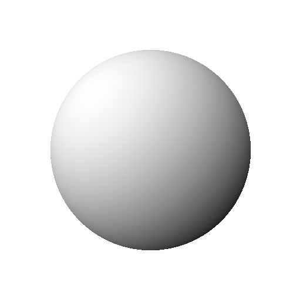

#  画个球
## 简介
在知乎上看了[用C语言绘制心形](https://www.zhihu.com/question/20187195/answer/34873279)，理解了思路，我自己也试着做一个球体版的。

程序根据圆形和球体的方程，画个球输出到控制台；输出到ppm图像文件；输出球体光照角度变化时的动画。

## 食用说明
- 更改main()中的caseID数值（目前为0-6），可以得到不同效果。

- 确保安装了c编译器，如gcc，简单调用 `gcc -o sphere sphere.c` 即可编译。

- case5和case6需要在windows环境下。

## 效果
- 控制台绘制，输出一个圆形，内部填充统一符号

  

- 控制台绘制，输出一个圆形，内部等值线填充不同符号

  

- 控制台绘制，输出一个球体，根据法线与光线夹角余弦值填充不同符号

  

- PPM图像输出,输出一个球体，根据法线与光线夹角余弦值填充不同灰度值

  

- PPM图像序列输出,光照方向改变下的球体，另外这次是一个红色为固有色。
 （已经人工把图像序列合成了gif动图）

  

- 控制台动画，球的心跳状动画
 
-  

- 控制台动画，球的光照方向动画
 
-  

# 附
ppm图像格式：https://zh.wikipedia.org/zh-hk/PBM%E6%A0%BC%E5%BC%8F

